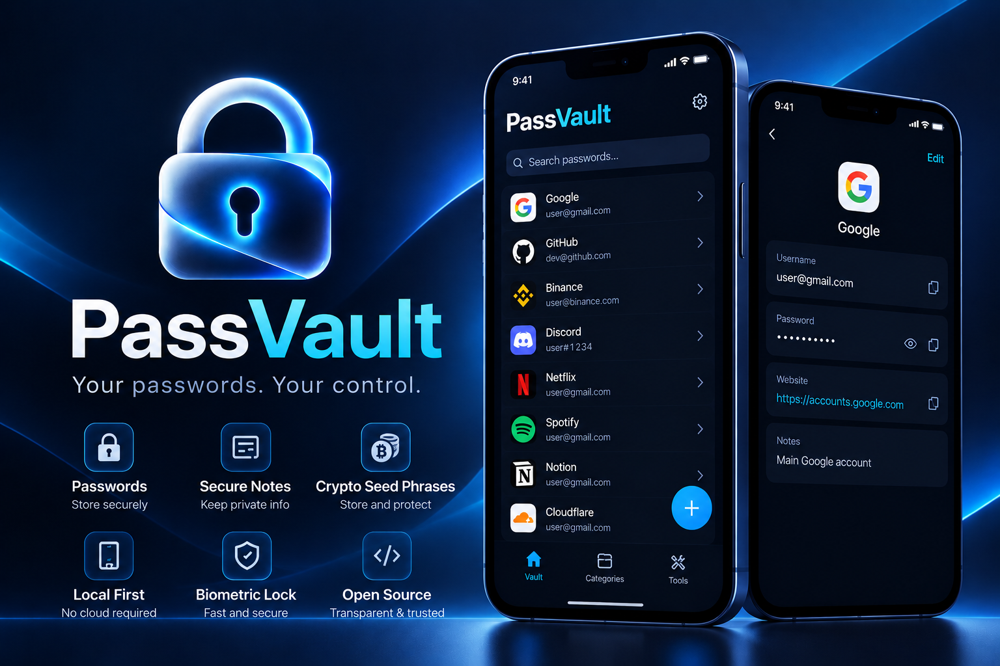
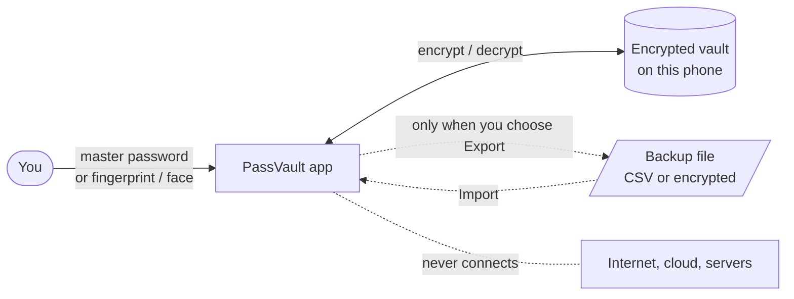
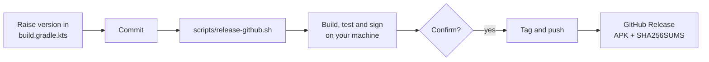
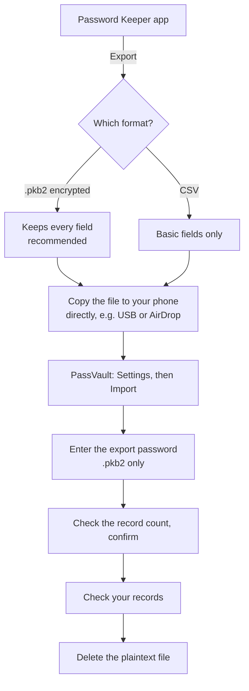

<div align="center">




# 🔐 PassVault

**Your passwords, on your phone, and nowhere else.**

A fully offline password vault with a native app for **iOS** (SwiftUI) and **Android** (Kotlin / Jetpack Compose).

Built as a new home for people leaving **BlackBerry Password Keeper**: it imports Password Keeper's backups directly.

No account · No server · No analytics · No cloud sync

[](https://github.com/daocha/password-vault/releases)
[](LICENSE)
[](https://github.com/daocha/password-vault/releases/latest)
[](android)
[](ios)
[](#-download-android)
[](#-build-for-ios)
[](docs/SECURITY.md)
[](https://github.com/daocha/password-vault)

[](https://github.com/daocha/password-vault/releases/latest)

</div>

> [!IMPORTANT]
> **Open source, and not independently audited.**
> PassVault uses established encryption (Argon2id and XChaCha20-Poly1305 via libsodium), keeps everything on your device, and has no network features. The code is public, so you can read it and judge for yourself.
> No professional security review has been done yet. As with any password manager you haven't audited yourself, **keep a separate backup of anything important.**
>
> 📖 See the [security model](docs/SECURITY.md) for what it does and doesn't protect against, the [feature status](docs/FEATURES.md), and the [encrypted file format](docs/FORMAT.md).

---

## 📑 Contents

[✨ Features](#-features) · [📥 Download](#-download-android) · [🍎 Build for iOS](#-build-for-ios) · [🤖 Build for Android](#-build-for-android) · [🚚 Moving your passwords in](#-moving-your-passwords-in) · [🛡️ Security checks](#%EF%B8%8F-security-checks) · [✅ Project status](#-project-status)

---

## 🧭 How it works

Everything happens on your phone. Your master password unlocks the vault, and nothing leaves the device unless you export a file yourself.



The dotted "never connects" line is deliberate: PassVault has no network features, so there is nothing to sign in to and nothing to sync.

---

## ✨ Features

| | |
|---|---|
| 🔑 **Easy, safe unlocking** | Unlock with your master password or your fingerprint / face. After 10 wrong attempts, the vault on that device is erased. |
| 🗄️ **Encrypted on your device** | Every record is encrypted and stored locally. Nothing is ever uploaded. |
| 🔎 **Find things fast** | Search, star your favorites, and organize records into groups. |
| 📝 **Flexible records** | Add several usernames, passwords and notes to one record, plus security question-and-answer pairs, in the order you want. Secrets stay hidden until you reveal them. |
| 🎲 **Password generator** | Create strong passwords with adjustable length and character types. |
| 📤 **Backup and restore** | Export as CSV or as an encrypted file, and import them back after confirming. Exporting asks for your password first. |
| 🔄 **Change master password** | Update it any time from settings. |
| 📋 **Careful clipboard** | Copied passwords are handled with care so they don't linger. |

The app icon is shared by both platforms. See [`assets/README.md`](assets/README.md) for the prompt and asset details.

---

## 📥 Download (Android)

The quickest way to try PassVault on Android is the ready-made APK:

1. Open the **[Releases](../../releases)** page of this repository.
2. Pick the latest version and download **`PassVault-<version>-<build>.apk`** from *Assets*.
3. Open the file on your phone and allow *Install unknown apps* when Android asks.

Requires **Android 11 or newer**.

> [!NOTE]
> Every release tag carries its own APK. For iOS, please build the app yourself (see below).

---

## 🍎 Build for iOS

**You'll need:** full Xcode (Command Line Tools alone can't build the app or run XCTest), an iPhone or iPad on **iOS 17+**, and [XcodeGen](https://github.com/yonaskolb/XcodeGen).

```sh
cd ios
xcodegen generate
open PassVault.xcodeproj
```

Then:

1. Choose your signing team in Xcode and build to a real device.
2. Swift Package Manager fetches the pinned libsodium wrapper automatically.
3. Set a device passcode before creating a vault. To use biometric unlock, first enroll Face ID or Touch ID, then turn it on in the app's settings.

---

## 🤖 Build for Android

**You'll need:** JDK 17 and Android SDK 36. Open the `android/` folder in Android Studio, or use the command line:

```sh
cd android
./gradlew :app:assembleDebug :app:testDebugUnitTest
```

Point `ANDROID_HOME` at your SDK, or create an untracked `android/local.properties` containing `sdk.dir=...`. Test biometrics on a real phone.

<details>
<summary><b>📦 Making a signed release (APK and Play Store bundle)</b></summary>

<br>

No shared development key is included, and your signing key never goes on GitHub.

- Run `scripts/build-android-release.sh` to make a signed **AAB** (for Google Play) and a signed **APK** (for sideloading and GitHub Releases). On first use it creates your upload keystore. Results land in `dist/`.
- Already have installs signed with an older key? Run `scripts/rotate-signing-key.sh` once (it defaults to rotating from the Android debug key). Afterwards, the build script attaches the rotation lineage to the APK automatically, so existing users update in place without losing data.
- **Back up** both keystores and `~/.passvault-signing/lineage.bin`. Losing them means you can't ship updates.
- To publish, run `scripts/release-github.sh`. It builds the signed APK, then (after you confirm) tags `vX.Y.Z`, pushes the tag and creates the GitHub Release with the APK and its checksum file. Add `--draft` to review the release on GitHub before it goes public. You need the [GitHub CLI](https://cli.github.com) (`gh auth login` once).



</details>

---

## 🚚 Moving your passwords in

**Coming from BlackBerry Password Keeper?** PassVault imports its backup files directly, on both iOS and Android. Password Keeper offers two export types, and they are not equal:

| Export | What survives |
|---|---|
| **`.pkb2`** (encrypted) ✅ recommended | Everything, including extra usernames, passwords and other fields |
| **CSV** | Only the basics; extra fields are dropped |



**How to import**

1. Transfer the file to your phone locally.
2. Unlock PassVault → **Settings** → **Import**, then pick the file.
3. For `.pkb2`, enter the password you chose when exporting. CSV needs no password.
4. Check the record count and confirm.
5. Verify your records, *then* delete the plaintext migration file.

> [!TIP]
> Never commit real credentials. CSV and backup files are ignored by Git.

**Good to know**

- Your app password needs **at least 12 characters**, with upper- and lowercase letters, a number and a symbol. Length matters because encrypted backups can be attacked offline.
- On Android, exporting asks for your app password once (this counts as an attempt) and encrypts the backup with it.
- Encrypted backups can be imported on **either platform**.
- There is **no password reset**. If you forget your master password, nobody can recover it for you.
- Exported files are independent of local erasure: wiping the vault does not delete files you exported.
- The system file picker may show cloud providers, but PassVault itself has no cloud integration.

---

## 🛡️ Security checks

The portable Swift core can be tested without full Xcode:

```sh
swift run --package-path ios vault-security-checks
```

To check a local migration file without copying credentials into the repo or printing them:

```sh
PASSVAULT_TEST_CSV=/path/to/your_backup.csv \
  swift run --package-path ios vault-security-checks
```

With full Xcode you can also run `swift test --package-path ios`. Build tools need internet to fetch dependencies; the finished app never does.

---

## ✅ Project status

**Verified so far**

- ✔️ The Swift core compiles, and **95 standalone security and migration checks pass**, including the supplied CSV.
- ✔️ The iOS UI source passes Swift syntax parsing.

**Not yet verified** (release blockers, not proof that the apps pass)

- ⏳ Android CSV/schema unit tests exist but haven't been run.
- ⏳ Full mobile builds, native UI type checking and biometric behavior.
- ⏳ XCTest, which was unavailable on the development Mac (no full Xcode, Android SDK or JDK at first).
